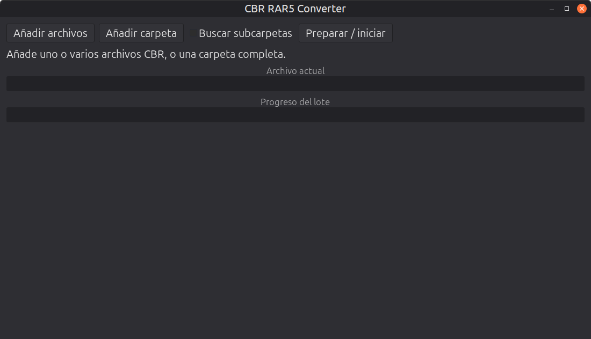

<a href="README.en.md">🇺🇸 English</a>

  

<h1 align="center">CBR RAR5 Converter</h1>

  
  
  
  
  
  
  
  
  
  

  Convierte de forma segura archivos <code>.cbr</code> en formato RAR4 al formato RAR5, sin modificar los
  originales.

  

Aplicación de escritorio (GTK 4 + PyGObject, interfaz en español e inglés), de uso personal: sin servidor ni cuenta,
todo ocurre en tu equipo.

- **Detecta** el formato de cada `.cbr` por su cabecera, no por la extensión.
- **Busca** archivos o carpetas completas, con opción de recorrer subcarpetas.
- **Convierte** de forma segura: temporal, validación de la cabecera RAR5 y sustitución atómica, sin
  sobrescribir destinos existentes.
- **No modifica los originales**: el resultado se guarda en una subcarpeta `Corregido`, preservando la ruta
  relativa.
- **Progreso por archivo y por lote** al convertir varios cómics a la vez.

## Documentación

Toda la documentación —instalación, guía de uso, especificaciones técnicas, solución de problemas y más— está en
la **[wiki del proyecto](https://github.com/seguidodoblado/CBR-RAR5-Converter/wiki)** (español e inglés).

## Privacidad

CBR RAR5 Converter no tiene servidor ni cuenta propios, no se conecta a Internet y no recoge datos. Qué se guarda y dónde está en la **[política de privacidad](PRIVACY.md)**.

## Licencia

Este proyecto se distribuye bajo la GNU General Public License, versión 3 (ver `LICENSE`).
